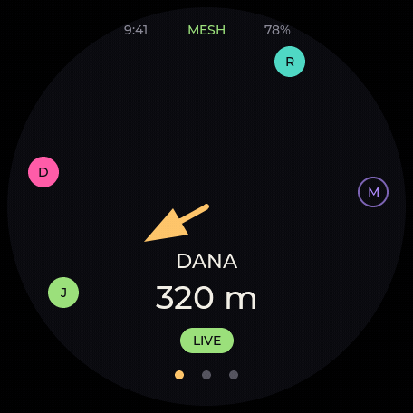
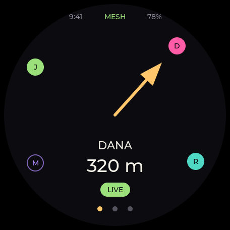
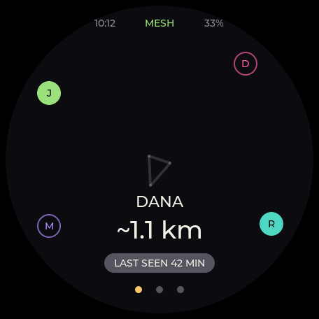
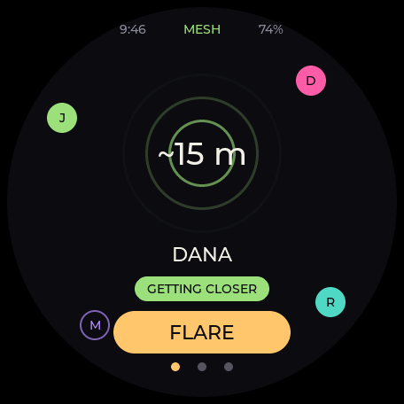
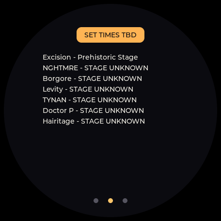
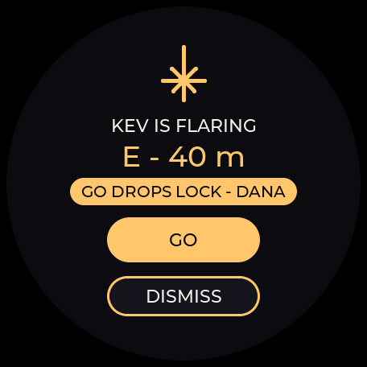
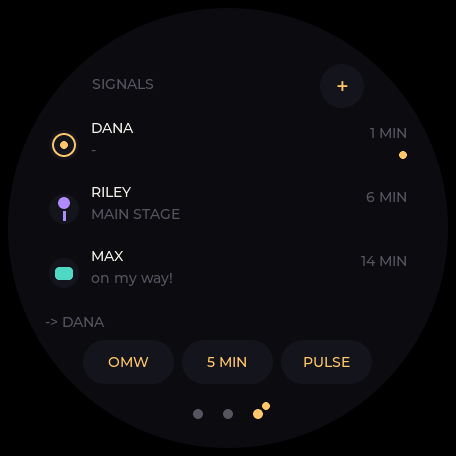
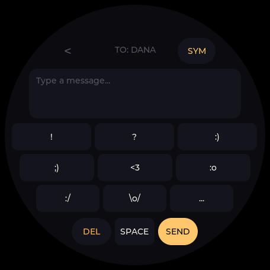

# Firefly

**An open-source festival compass that points at your friends.**

Firefly is a palm-sized round-screen puck for music festivals: a compass arrow that points at your crew over LoRa mesh radio, off-grid messaging (pulses, canned replies, T9), the full lineup with set alarms, and a vector map of the grounds — so your phone stays at camp.

<p align="center">
  
</p>

<p align="center"><em>Not a mockup — that's the firmware rendering, frame by frame.<br>
Four of the six v1 faces, running. The arrow finds your friend, the lineup admits which set times<br>aren't published yet, you can message without a network, and a flare takes over when someone needs finding.</em></p>

## Status

**Four of the six v1 faces are built and on `main`** — Radar, Now, Signals (with its T9 composer) and Flare. Map and Settings aren't started. Parts are ordered; the app runs today on a desktop simulator that renders the real screens. What's left is the app shell that makes them a running device, those two faces, and the device target itself — display driver, the link to the comms brain, sensors — which needs the hardware in hand. First field test: **Lost Lands, Sep 18–20 2026**.

This table is meant to be accurate rather than flattering — if something renders but can't run on hardware yet, it says so.

| Piece | State |
|---|---|
| Core logic — geo/bearing math, crew model & freshness, schedule engine, settings, T9, flare state machine | ✅ on `main` |
| Meshtastic client library (`meshclient`) | ✅ on `main` |
| festpack parser + the [Lost Lands 2026 pack](https://github.com/jakeholland/fest-almanac) | ✅ on `main` |
| **Radar face** — live / stale / lost / no-fix / no-selection | ✅ on `main` |
| Radar **close-range** mode — signal-strength rings under ~30 m | ⚠️ renders, no consumer yet ([#35](https://github.com/jakeholland/firefly/issues/35)) |
| **Now face** — live set times, starred-set countdown, and honest "times not published yet" states | ✅ on `main` |
| **Flare** — takeover screen, sender state, navigation lock | ✅ on `main` |
| Dev harness — control socket, dockerised Meshtastic node, end-to-end tests | ✅ on `main` |
| **Signals + Compose** — pulses, rally points, canned replies, and a T9 keypad with ABC/123/SYM pages | ✅ on `main` |
| **Map face** — vector festival grounds with crew dots | ⏳ not started (S09) |
| **Settings face** — units, quiet hours, share mode, name | ⏳ model on `main`, no screen yet (S11 slice b) |
| App shell — event loop, face routing, wall clock | ◐ in progress (S16) |
| ESP32-S3 device target, enclosure | ⏳ when boards arrive |

Every merged line went through an independent code review plus, for anything on screen, a review in the persona of a tired raver at 2 a.m. ([why](docs/review/ux-raver.md)).

### On `main` today

| Live | Lost | Close range |
|---|---|---|
|  |  |  |
| A fresh fix. Solid arrow, exact distance. | The fix is old. Different in *kind*, not just dimmer — the screen stops claiming to know. | Under 30 m, GPS is useless in a crowd. Rings and a hot/cold trend take over. **Renders, but can't trigger on hardware yet** — see below. |

The middle one is the point of the whole project: most trackers keep pointing confidently at data they no longer have.

> **On close-range mode, honestly.** It renders, it has tests and golden screenshots — and it has never run on a radio. Signal strength now reaches the app, but nothing consumes it yet, so the mode can't trigger ([#35](https://github.com/jakeholland/firefly/issues/35)). A screenshot proves a thing draws, not that it works.

| Set times, honestly | A flare arriving |
|---|---|
|  |  |
| Lost Lands hasn't published set times yet, so the puck says so and lists the day instead of inventing a schedule. | Press and hold, and your crew's pucks light up and point at you. If you were already navigating to someone else, it tells you what GO will cost you. |

| Signals | Typing, off-grid |
|---|---|
|  |  |
| Pulses, rally points, and one-tap replies — most festival coordination is four words or fewer. | A T9 keypad, because a QWERTY at 37 mm is a joke. ABC, 123, and a symbols page. |

## How it works

Firefly is a **dual-brain** device:

- **Comms brain** — a Seeed XIAO ESP32S3 + Wio-SX1262 stack running **stock, unmodified [Meshtastic](https://meshtastic.org)** with an L76K GPS. It owns the mesh, encryption, and positions, and gets free interop with every Meshtastic node on site.
- **UI brain** — a Waveshare ESP32-S3-Touch-LCD-1.46 (412×412 round touchscreen, IMU, mic) running the Firefly app on LVGL. It will talk to the comms brain over UART using Meshtastic's documented client API — the same protocol the official phone apps speak. *Today the app speaks that API over TCP to a `meshtasticd` on your desktop; the UART link arrives with the device target (S15).*

No fork to maintain, no phone required, ~$80 in parts. Battery life is a design target, not a measurement — nothing has run on the real hardware yet.

## Feature set (v1)

| Face | What it does |
|---|---|
| **Radar** | Big honest arrow + distance to a crew member; whole-crew dots; live/stale states. Close-range rings render but can't trigger yet ([#35](https://github.com/jakeholland/firefly/issues/35)) |
| **Now** | Lineup per stage, set progress, starred-set alarms |
| **Signals** | Pulses, rally points, canned replies, T9 composer |
| **Flare** | Press-and-hold "come find me" — crew pucks buzz and lock their arrows on you |
| **Map** *(not built yet)* | Vector festival grounds from a festival pack, crew dots included — specced as S09, wanted for v1, no code yet |
| **Settings** *(not built yet)* | Units, quiet hours, share mode, your name — the model is on `main`, the screen isn't (S11 slice b) |

Festival data (map polygons + lineup + set times) loads as a **festpack** — see [fest-almanac](https://github.com/jakeholland/fest-almanac), the open per-festival data repo.

## Try it without hardware

The whole app runs on macOS/Linux against a simulated round display:

```bash
cmake -S firmware -B build -DFF_TARGET=sim && cmake --build build -j8
ctest --test-dir build --output-on-failure     # the full suite
cd firmware && ../build/ffsim --fixture tests/fixtures/radar_live.json
```

Swap the fixture for any state in `firmware/tests/fixtures/` to see it rendered. Every screenshot in this README came out of that same binary — [`firmware/tools/social/render_scene.py`](firmware/tools/social/render_scene.py) is what turns a sequence of them into the animation above.

## Repo layout

```
firmware/   UI-brain application (LVGL, Meshtastic client API)
docs/       Architecture, specs, reviews, hardware notes
```

Planned, not yet present: `case/` (3D-printable ~82mm puck) and `web/` (browser
flasher + setup tools). Listing them as though they existed is the same
overclaim this README is trying not to make.

## Prior art & thanks

Standing on the shoulders of [Meshtastic](https://meshtastic.org), the [Friend Finder Edition](https://github.com/LeapYeet/Meshtastic-Firmware-Friend-Finder-Edition) fork, [iBurn](https://github.com/iBurnApp/iBurn-Data), and the badge scene (EMF Tildagon, badge.team). The consumer product that proved this market — Lynq — sold 20k units and then left for defense contracts. This one can't be taken away.

## History

This repo previously held a Meshtastic iOS/macOS client app — preserved at the [`archive/meshtastic-ios-app`](../../tree/archive/meshtastic-ios-app) branch and the `v0-ios-app` tag. Its BLE + protobuf client code remains a useful reference for the UI brain.

## License

**GPL-3.0-only** — see [LICENSE](LICENSE) and [docs/LICENSING.md](docs/LICENSING.md) for the reasoning (short version: the vendored Meshtastic protobuf derivations make GPL the honest choice, the ecosystem matches, and it's the license under which this project can't be taken away). Selling kits/assembled pucks under GPL is fine and encouraged — but the **Firefly name and flare mark are trademarks**: see [TRADEMARKS.md](TRADEMARKS.md) before selling anything under the name.
